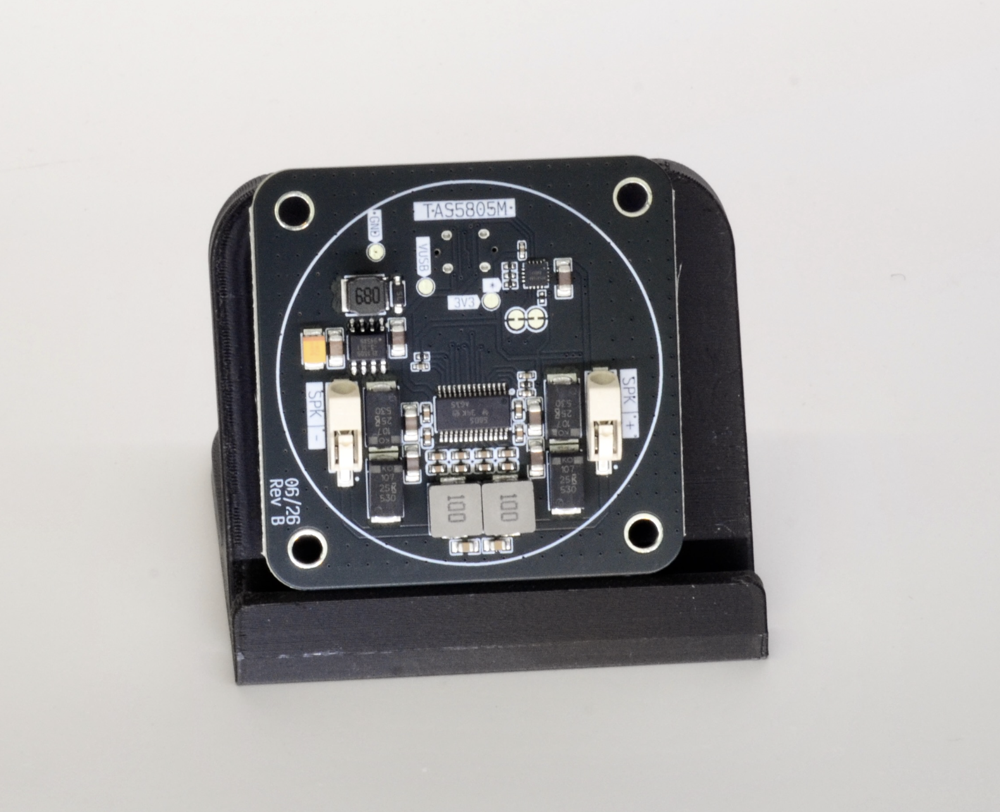
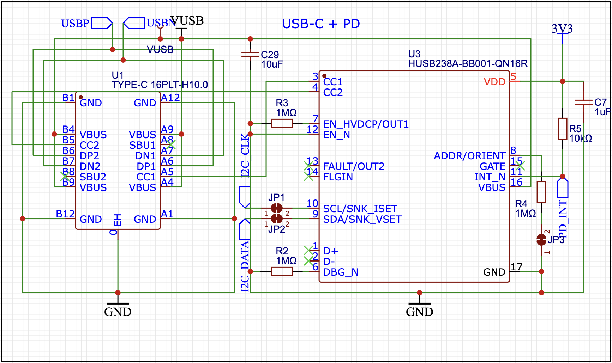
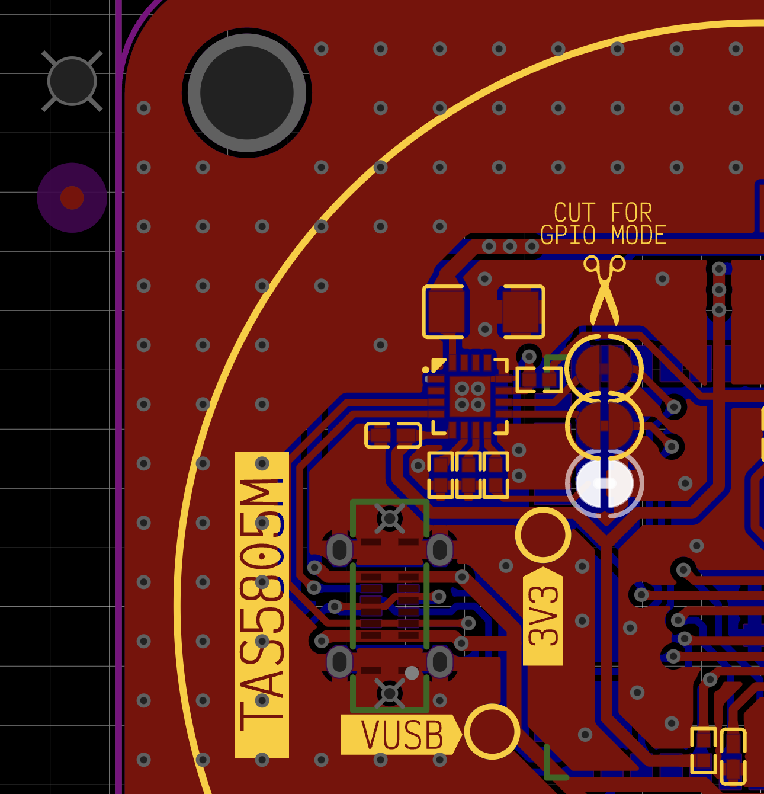

# esphome-husb238a

An [ESPHome](https://esphome.io) external component for the **Hynetek HUSB238A** USB-PD sink controller.



## Why this exists

ESPHome already has a `husb238` component, but it targets the plain **HUSB238** chip's register
map (addresses `0x00`-`0x09`). The **HUSB238A** is a different, pin-similar part with a much larger
register map (`0x00`-`0x91`) and, critically, gates every command (`REQUEST_PDO`, `GET_SRC_CAP`,
`HARD_RESET`, ...) behind a `CONTROL1.ENABLE` bit that doesn't exist on the plain chip. Talking to a
HUSB238A using the plain HUSB238's addresses looks like it works — every I2C read and write is
ACKed — but nothing actually happens: voltage selects silently no-op, and source capabilities never
populate.

This component targets HUSB238A's real register layout and sets the `ENABLE` bit during `setup()`,
so voltage selection and capability discovery actually work.



## Installation

Reference it as an external component in your ESPHome YAML:

```yaml
external_components:
  - source: github://sonocotta/esphome-husb238a
    components: [ husb238a ]
```

## Configuration

```yaml
i2c:
  sda: GPIO8
  scl: GPIO9

husb238a:
  id: husb_01
  address: 0x42  # 0x42 when ADDR/ORIENT is tied to GND, 0x62 when tied to VDD
  update_interval: 1s

binary_sensor:
  - platform: husb238a
    attached: "USB-PD Attached"

sensor:
  - platform: husb238a
    voltage: "Contracted Voltage"
    current: "Contracted Current"
    selected_voltage: "Selected Voltage"

text_sensor:
  - platform: husb238a
    status: "Last request status"
    capabilities: "Capabilities"

select:
  - platform: husb238a
    voltage: "Voltage selector"
```

### ESPhome UI


### Wiring notes

The `ADDR/ORIENT` pin must be tied to `GND` or `VDD` (through the datasheet's recommended ~900kΩ
resistor) for the chip to boot into I2C mode at all — leaving it floating puts the chip into a
resistor-strapped GPIO mode where I2C is disabled entirely.



## Entities

| Platform | Key | Description |
|---|---|---|
| `binary_sensor` | `attached` | Whether a USB-PD source is currently attached |
| `sensor` | `voltage` | Actual contracted voltage from the source |
| `sensor` | `current` | Actual contracted current from the source |
| `sensor` | `selected_voltage` | Voltage currently requested via `SRC_PDO` (may differ from `voltage` while a request is in flight) |
| `text_sensor` | `status` | Whether the last PD message exchange (`AMS`) succeeded |
| `text_sensor` | `capabilities` | Every voltage/current PDO the attached source advertises |
| `select` | `voltage` | Request a specific fixed voltage (`5V`/`9V`/`12V`/`15V`/`20V`) from the source |

### Voltage persistence

The chip itself forgets any requested voltage across a power cycle or hard reset and renegotiates
its Type-C default (5V). The driver works around this by saving the last requested voltage to flash
and re-requesting it during `setup()`, so a reboot restores the previous voltage instead of silently
dropping back to 5V. The `voltage` select also now reflects whatever `SRC_PDO` actually reports on
every poll, instead of only updating in response to a user's own selection (which used to leave it
showing "Unknown" until touched).

## Known limitations

- Only fixed PDOs (5V/9V/12V/15V/20V) are supported. HUSB238A also supports PPS, AVS, and EPR
  (28V/36V/48V) — not implemented here yet.
- The `current` sensor's scaling is derived from an unofficial, reverse-engineered register map (see
  Credits) rather than the public Hynetek datasheet, and may be slightly inaccurate immediately after
  a voltage change completes.
- No `cc_direction` sensor: unlike the plain HUSB238, CC orientation on HUSB238A is only exposed on
  the `ORIENT` output pin, not over I2C.

## Credits

Register addresses and bit-field layout are cross-referenced from:

- The [Hynetek HUSB238A datasheet](https://www.hynetek.com) (pin functions, `CONTROL1.ENABLE` gating,
  `ADDR/ORIENT` mode selection)
- [Pythonic-Rainbow/HUSB238A](https://github.com/Pythonic-Rainbow/HUSB238A), an independent C++
  register-level library for this chip, used to confirm register addresses and current/voltage
  scaling factors not published in the public datasheet

## License

GPL-2.0, see [LICENSE](LICENSE).
